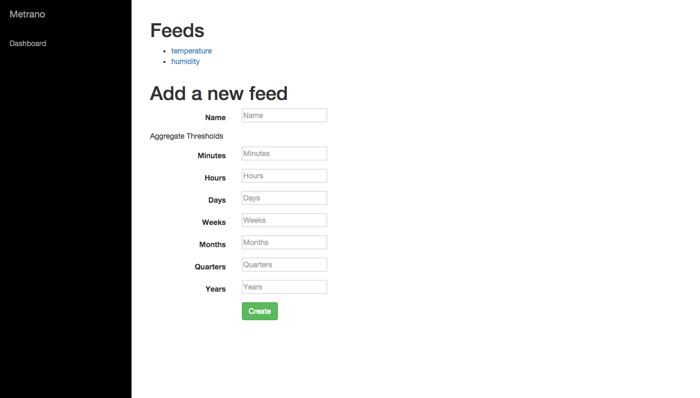

Metrano is an PostgreSQL backed HTTP server for time series aggregation.

This package provide both the server an a node.js library which exposes the
server's functionality.

It is designed to scale to billions (untested) of records per server. If you
need more capacity, you can either shard your data and run more DB instances or
you can look into Hadoop.

Install
=======

```npm install metrano --save```

Server
======

The server exposes a very basic user interface to browse feeds.

start with ```node metrano.js```

options:
- ```--cleanup``` to reset the config table





APIs
----

### list feeds

```
GET /feeds
[
  {
    name: "temperature",
    aggregateThresholds: {
      minute: "0",
      hour: "7200000",
      day: "172800000",
      month: "62208000000"
    },
    id: 1,
    _type: "feeds"
  },
  {
    name: "humidity",
    aggregateThresholds: {
      minute: "0",
      hour: "7200000",
      day: "172800000",
      month: "62208000000"
    },
    id: 2,
    _type: "feeds"
  }
]
```


### feed definition

```
GET /feed/<feedName>
{
  name: "temperature",
  aggregateThresholds: {
    minute: "0",
    hour: "7200000",
    day: "172800000",
    month: "62208000000"
  },
  id: 1,
  _type: "feeds"
}
```


### stats

```
GET /feeds/<feedName>/<deviceId>/stats

{
    count: <number_of_data_items>
}
```

Where:
- ```feedName``` is the name of the feed to retrieve data from
- ```deviceId``` is the unique id of the data of the feed or ```all`` to apply
to all devices

### fetch data

```
GET /feeds/<feedName>/<deviceId>/<aggrFunction>/<fromTimestamp>/<toTimestamp>
[
  { date: 1414800000000, value: 18.322324 },
  { ... }
]
```

Where:
- ```feedName``` is the name of the feed to retrieve data from
- ```deviceId``` is the unique id of the data of the feed
- ```aggrFunction``` is the calculation function to apply to feed values when
they need to be aggregated. Can be one of:
  - ```sum```
	- ```avg```
	- ```count```
	- ```max```
	- ```min```
	- ```stddev_pop``` population standard deviation of the input values
	- ```stddev_samp``` sample standard deviation of the input values
	- ```var_pop``` population variance of the input values (square of the population standard deviation)
	- ```var_samp``` sample variance of the input values (square of the sample standard deviation)
- ```fromTimestamp``` the time in milliseconds since UTC Epoch from which data should be retrieved
- ```toTimestamp``` the time in milliseconds since UTC Epoch until which the data should be retrieved

The data is automatically aggregated based on the feed configuration and the
requested time interval.

### push values

a single data point:

```
POST /api/feeds/<feedName>/<deviceId>
{
	value: 123,
	timestamp: 1414943636741
}
```

The timestamp (in milliseconds) timezone is interpreted as UTC.

### define a new metric

```
POST /api/feeds
{
	name: 'temperature',
	aggregateThresholds: {
		minute: 0,
		hour: (2 * 60 * 60 * 1000),
		day: (2 * 24 * 60 * 60 * 1000),
		month: (24 * 30 * 24 * 60 * 60 * 1000)
	}
}
```

The ```aggregateThresholds``` attribute contains the timestamps for which an
aggregate should kick off.
Depending on the amount of data you want to retrieve, Metrano will reduce it
based on the values in the configuration.

Available aggregates references are:
- ```microseconds```
- ```milliseconds```
- ```second```
- ```minute```
- ```hour```
- ```day```
- ```week```
- ```month```
- ```quarter```
- ```year```
- ```decade```
- ```century```
- ```millennium```


Client
======

```
var Metrano = require('metrano')

var metrano = new Metrano()
metrano.setRemoteURL('http://localhost:3000/')

metrano.define({
		name: 'temperature',
		aggregateThresholds: {
			minute: 0,
			hour: (2 * 60 * 60 * 1000),
			day: (2 * 24 * 60 * 60 * 1000),
			month: (24 * 30 * 24 * 60 * 60 * 1000)
		}
	}, function(err) {
		// metric ready
})

metrano.remove(feed, function(err) {
		// feed removed
})

metrano.push(<feed>, <device_id>, <value>, <UTC_timestamp>, function(err) {
	// metric saved if no error
})
```
